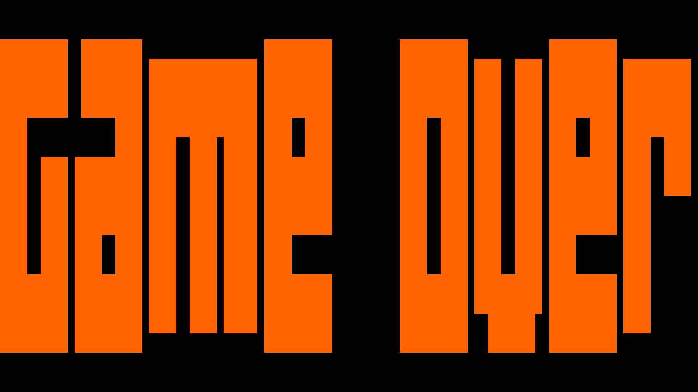

# goflap Game

Flappy Bird is a simple and addictive game developed using Golang. The objective of the game is to navigate a bird through a series of pipes without hitting them or the boundaries of the game window.

## Features

- Simple and intuitive gameplay.
- Responsive controls.
- Graphics and sound effects.
- Bird animation.
- State variable updates.

## Prerequisites

Before running the game, make sure you have the following prerequisites installed on your system:

- Golang: [Installation Guide](https://golang.org/doc/install)

## Installation

1. Clone the repository:

git clone https://github.com/gopal96685/goflap

2. Navigate to the project directory:

cd goflap

3. Install the necessary SDL packages:

Ubuntu

sudo apt-get install libsdl2-dev libsdl2-image-dev libsdl2-mixer-dev libsdl2-ttf-dev

macOS

brew install sdl2 sdl2_image sdl2_mixer sdl2_ttf

4. Build the game:

go build

## Usage

1. Run the game:

./flappy-bird-game

2. Use the spacebar to control the bird's movement. Press spacebar to make the bird jump and avoid the pipes.

3. The game will continue until the bird collides with a pipe or the game window's boundaries.

## Contributing

Contributions are welcome! If you would like to contribute to this project, please follow these steps:

1. Fork the repository.

2. Create a new branch:

git checkout -b feature/your-feature

3. Make your changes and commit them:

git commit -m "Add your message here"

4. Push to the branch:

git push origin feature/your-feature

5. Create a new pull request.

## License

This project is licensed under the [MIT License](LICENSE).

## Acknowledgements

- The Flappy Bird game concept was originally created by Dong Nguyen.
- The game development tutorial and code snippets provided by OpenAI GPT-3.5.

## Contact

For any inquiries or suggestions, please contact [your-name](mailto:your-email@example.com).

